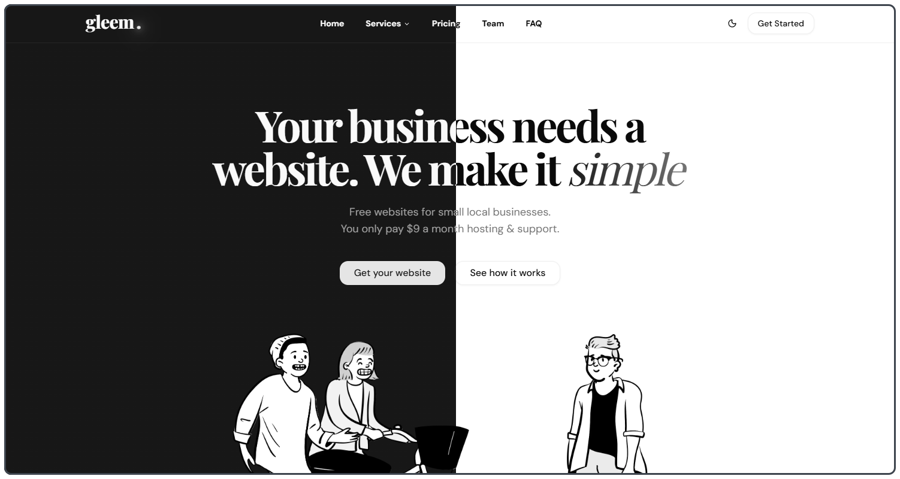
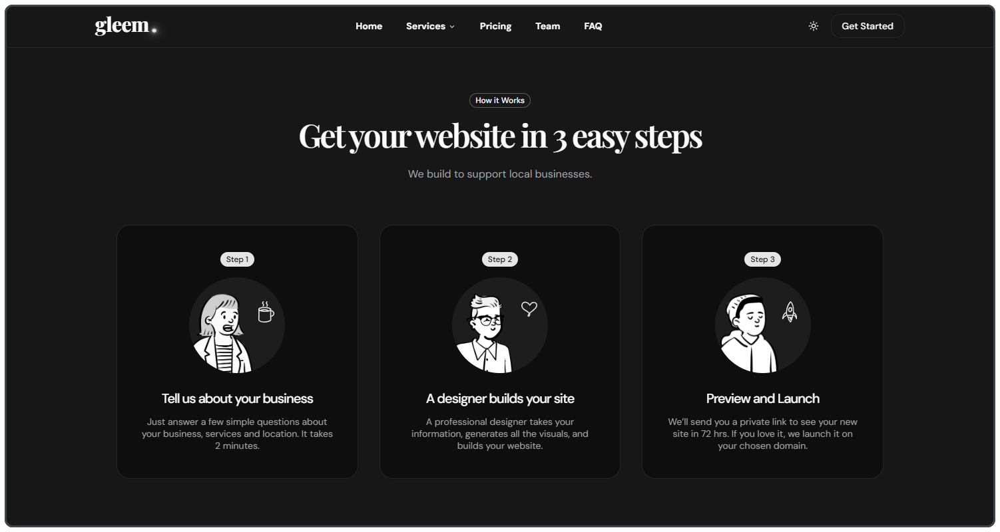
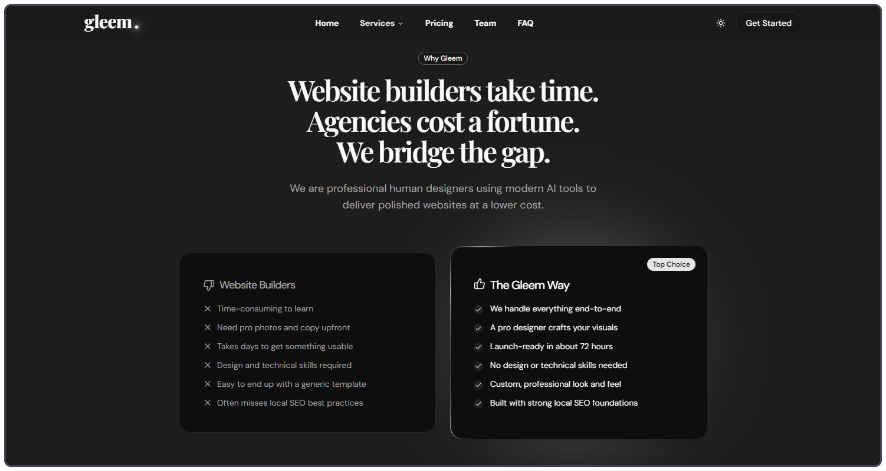
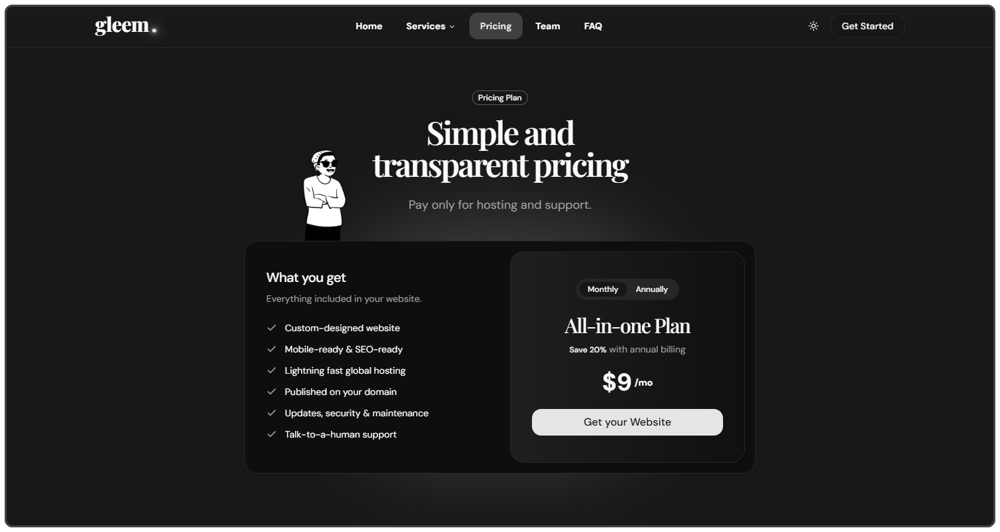
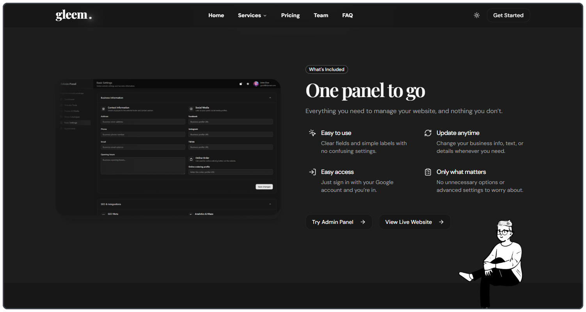
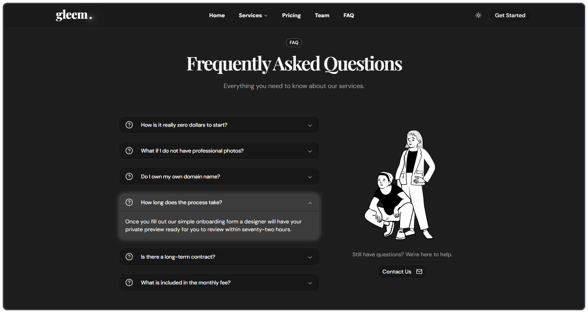
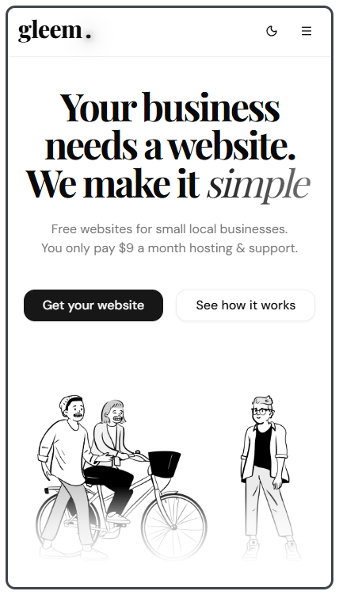
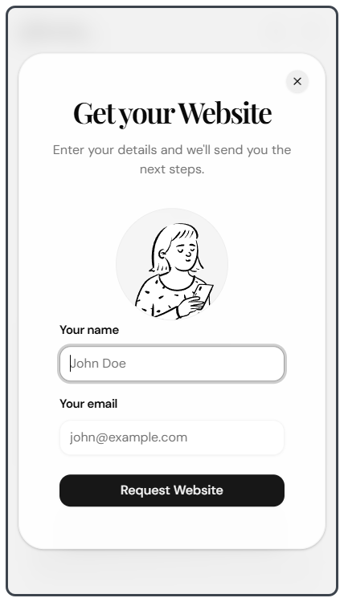
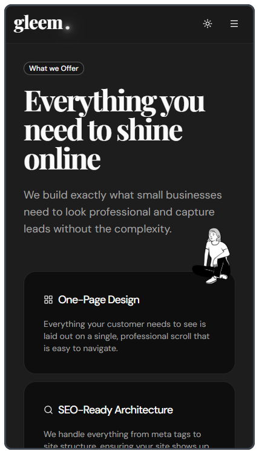
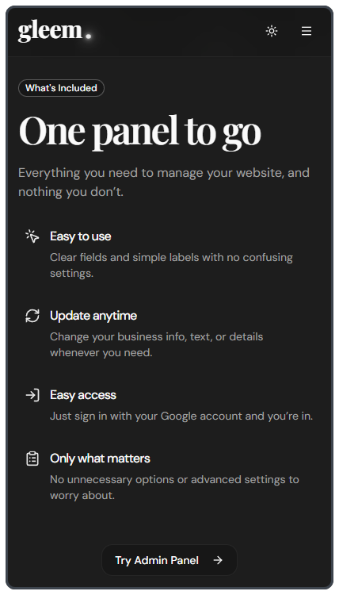

# Gleem: SaaS Landing Page


Marketing landing page for **Gleem**, an original portfolio concept exploring a SaaS model for delivering affordable one-page websites to small local businesses.

🌐 [View Live](https://getgleem.vercel.app) &nbsp;&nbsp; 🍽 [See a Live Example: theGreek](https://thegreekrestaurant.vercel.app) &nbsp;&nbsp; 🎛 [Try the Admin Panel](https://thegreekrestaurant.vercel.app/login)

---

## The Concept

Small local businesses (restaurants, barbers, electricians, plumbers) still rely on bloated WordPress installs and overpriced hosting when all they need is a fast, professional one-page site.

Gleem bridges that gap: a human designer (AI-assisted) builds the site quickly, and the business owner manages their content through a simple panel. Hosted on services like Vercel, the infrastructure cost is near zero, passed on as an affordable flat monthly fee.

The live demo linked above, [theGreek](https://github.com/vasilisgee/thegreek), is the actual product Gleem sells, fully deployed with a working CMS admin panel.

## Project Highlights

- Full SaaS marketing landing page with conversion-focused layout and clear CTA hierarchy
- Scroll-triggered animations via Framer Motion throughout all major sections
- Monochrome design system with a consistent line-art illustration character set
- Interactive pricing toggle (monthly / annual billing)
- Modal lead capture flow with form validation and toast notification feedback
- Contact form with simulated submission
- Live links to a real deployed product as the in-page demo
- Consent-aware Google Analytics setup with a reusable cookie banner and persistent user choice

## Screenshots

<p>
  
  
  
  
  
  
  
  
  
  
</p>

## Tech Stack

- Next.js App Router
- React 19
- TypeScript
- Tailwind CSS v4
- shadcn/ui
- Framer Motion
- Vercel

## Design Decisions

**No accent color:** the entire UI runs on black, white, and grey. CTA hierarchy is handled through fill, border weight, and a shine/glow hover effect on primary buttons. The monochrome palette was a deliberate choice to complement the line-art illustration set and create a bold, memorable identity without relying on color as a crutch.

**Illustration system:** three recurring characters from the same FreePeeps illustration set are used consistently across sections, giving the page a cohesive visual personality.

**Single pricing plan:** The target audience (local business owners) benefits from zero decision fatigue. One plan, one price, everything included.

**Frontend-only architecture:** The project demonstrates what a polished, production-grade marketing site can achieve purely on the frontend, with Framer Motion handling the interaction layer and shadcn/ui providing the component foundation.

---

## Local Setup

```bash
npm install
npm run dev
```

If you want Google Analytics enabled locally, create a `.env.local` file based on `.env.example` and set:

```bash
NEXT_PUBLIC_GOOGLE_MEASUREMENT_ID=G-XXXXXXXXXX
```

Open `http://localhost:3000`

---

## Part of the Gleem Ecosystem

This landing page is one half of a two-project portfolio exercise:

- **Gleem** (this repo), the company marketing site
- **[theGreek](https://github.com/vasilisgee/thegreek)**, the actual product Gleem delivers, with full CMS admin panel

Both projects are documented at **[vasilisportfolio.com](https://vasilisportfolio.com)**.

## License

This project is personal and educational work. Free to explore and reference. Commercial use or redistribution is not permitted without permission.
